# GAMES101 Assignment

### Assignment1

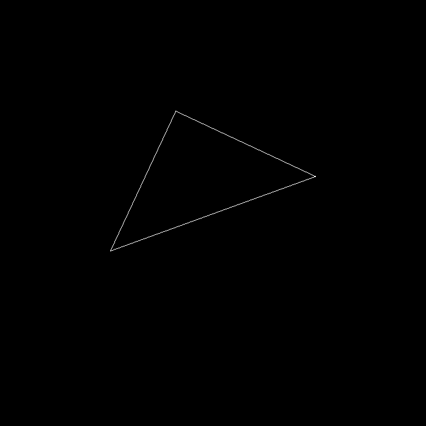

### Assignment2

### Assignment3

+ phong shading

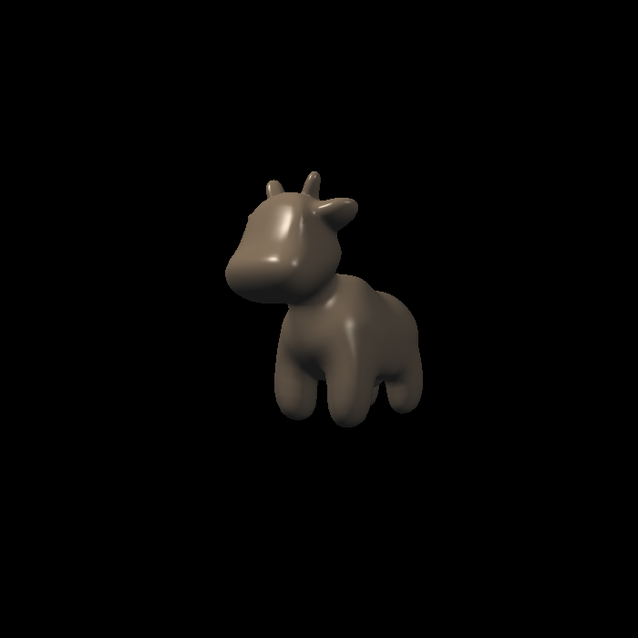
+ normal shading

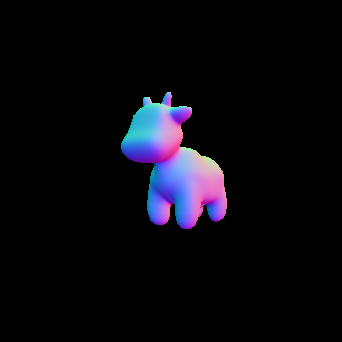
+ texture shading

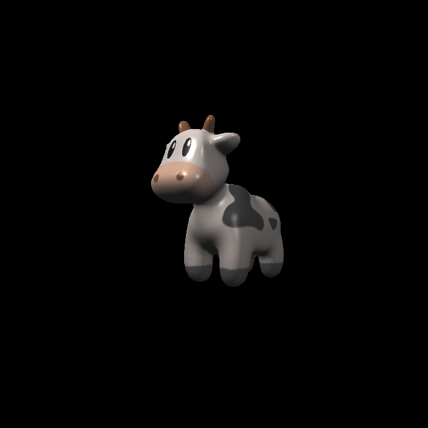
+ bump shading

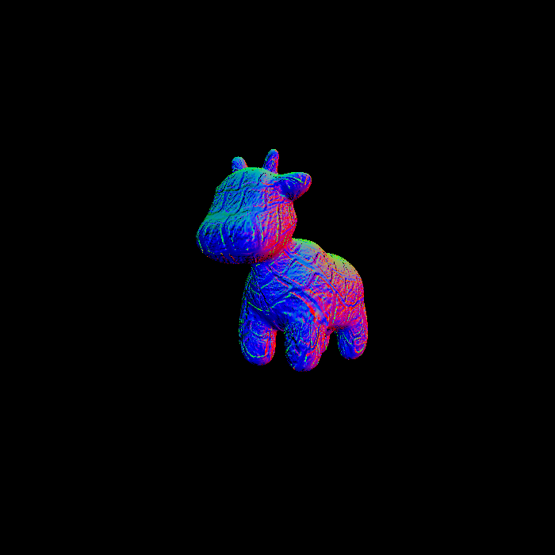
+ displacement shading

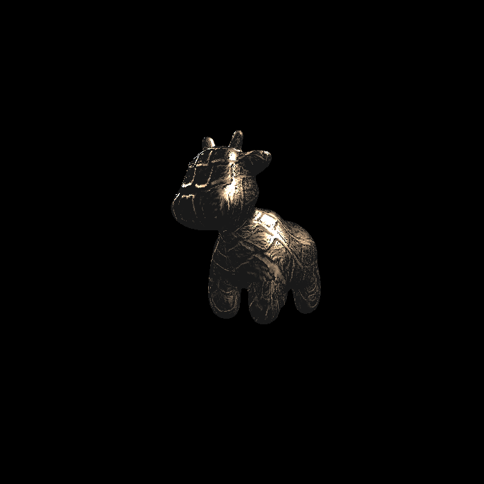
+ **simple sample**(left) vs **bilinear sample**(right)

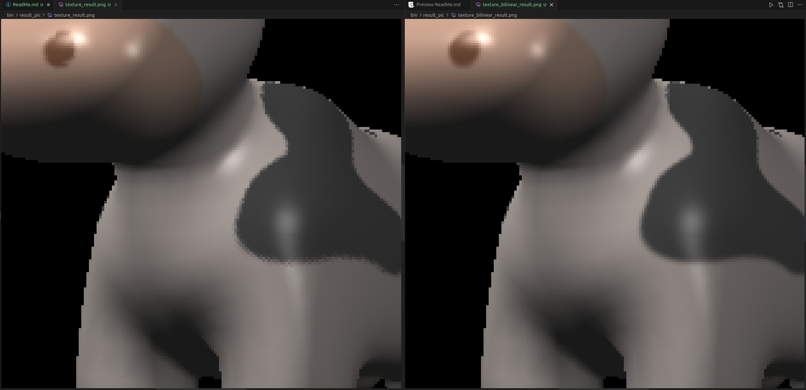

### Assignmet4

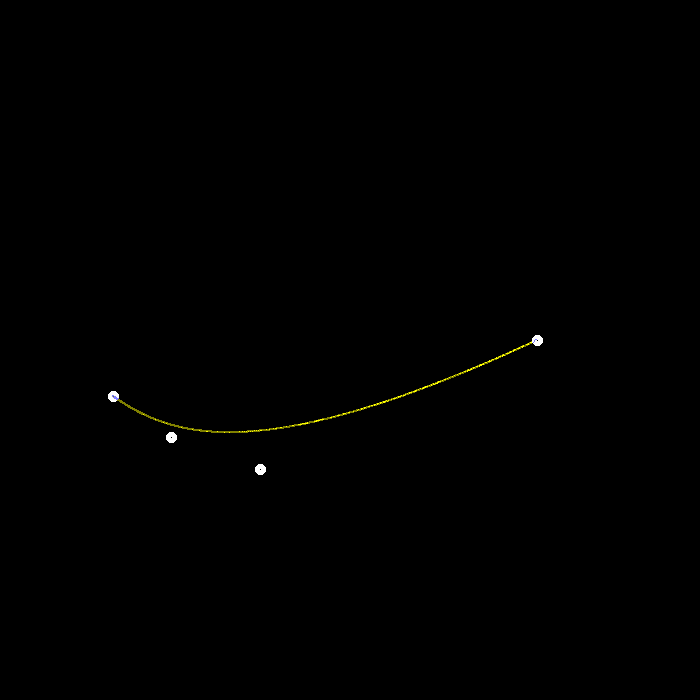

### Assignment5
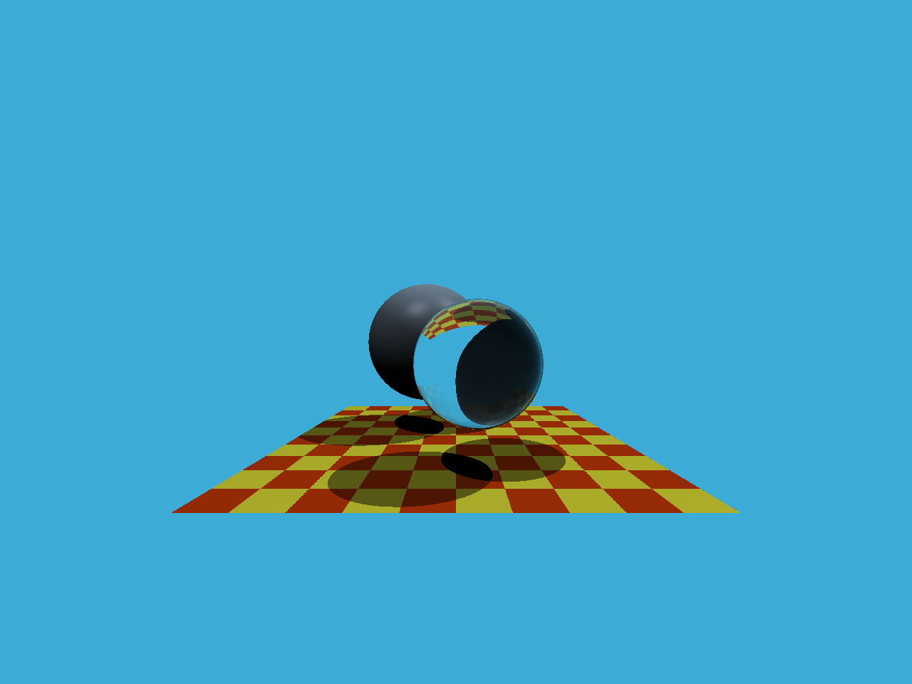

### Assignment6

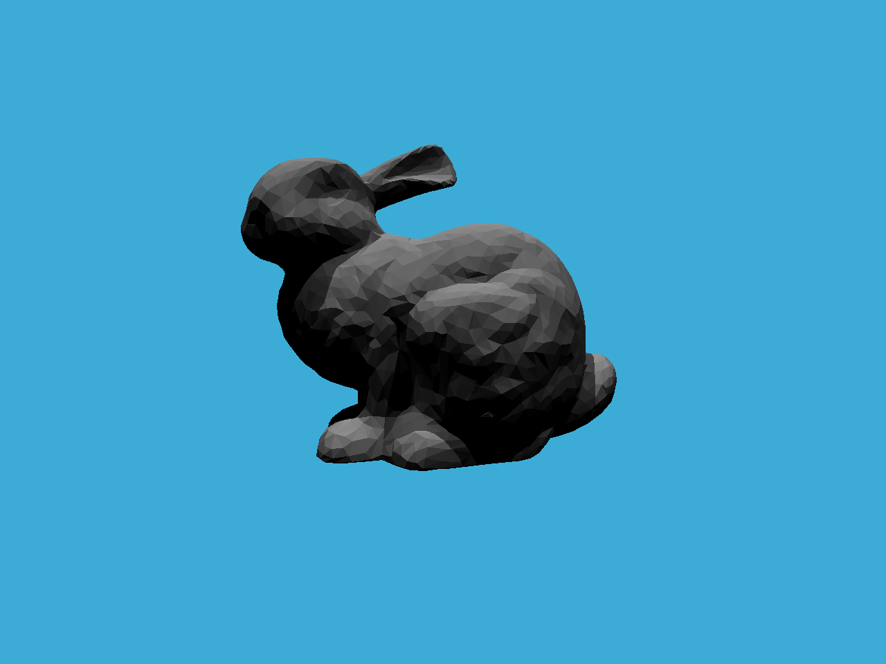

### Assignment7

Update Date: 2023-6-19
spp:2000 
仍存在问题，阴影部分有大量噪点，在spp从1024增加到2000后并未有明显改变
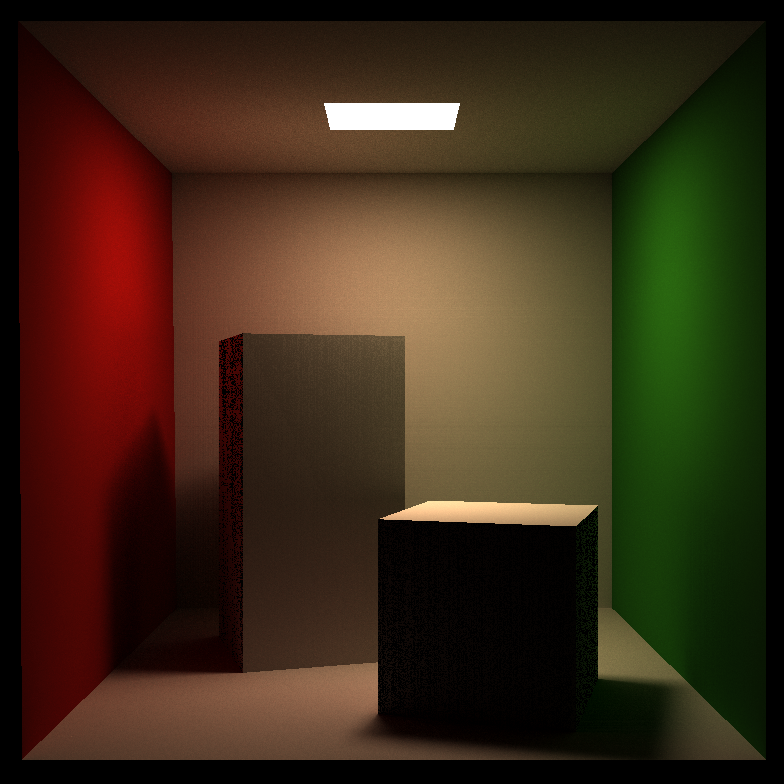

### Assignment8
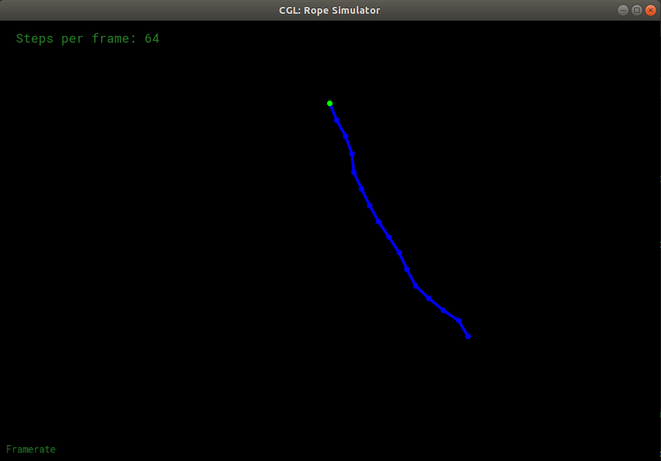

### 存留问题：
+ Assignment6 - SAH加速结构
+ Assignment7 - 噪点问题